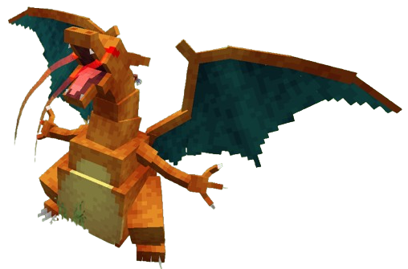

# Cobblemon Alphas

<h3>A fully data-driven Alpha Pokémon ecosystem for Cobblemon 1.7.2</h3>

Cobblemon Alphas expands the wild world of Cobblemon with rare, powerful Alpha Pokémon,
dynamic herd behavior, configurable spawning, and full datapack support.

 

### What this mod adds

- Rare Alpha Pokémon with enhanced stats and behaviors  
- Species-specific spawning via datapacks  
- Optional shiny and hidden ability boosts  
- Underground Alpha support  
- Fabric and NeoForge compatibility  

## Features

### Alpha Pokémon
- Wild-spawned Alpha Pokémon with configurable size scaling  
- Improved IVs and optional hidden abilities  
- Tutor move mastery  
- Optional shiny chance increase  
- Fully datapack-driven per-species definitions  

### Herd System
Certain Alpha species may spawn with a linked group.

**Following**  
Herd members maintain loose formation around the Alpha.

**Combat Reaction**  
When the Alpha enters battle, herd members flee.

**Regrouping**  
After danger passes, the herd returns and resumes formation.

**Persistent Linking**  
Herd members permanently track their associated Alpha.
